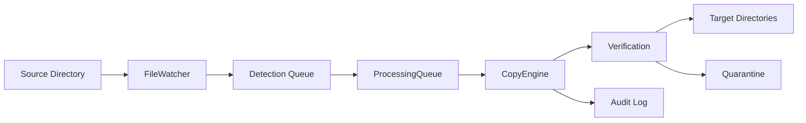

# FileCopier Service - SVS File Processing System

**Version:** Phase 5A
**Status:** Production Ready (80% Complete)
**Platform:** Windows Server/Desktop with PowerShell Core 7+

## Overview

FileCopier Service is a comprehensive, production-ready file copying and processing system specifically optimized for large SVS (Aperio ScanScope Virtual Slide) medical imaging files. The service provides automated file monitoring, verification, multi-target copying, and robust error handling with enterprise-grade reliability.

### Key Features

- **🔍 Intelligent File Monitoring** - FileSystemWatcher with stability detection for large files
- **📁 Multi-Target Copying** - Simultaneous copying to multiple destinations with individual retry logic
- **✅ File Verification** - SHA256 hash verification with non-locking access for concurrent operations
- **🔄 Advanced Retry Logic** - Exponential backoff with circuit breaker patterns
- **📋 Comprehensive Audit Trail** - Structured JSONL logging for compliance and monitoring
- **🏥 Medical Imaging Optimized** - Designed for SVS files (500MB - 20GB) with memory-efficient streaming
- **🛠️ Windows Service Integration** - NSSM-based service with automatic recovery
- **📊 Health Monitoring** - Real-time health checks with performance metrics
- **⚡ Production Ready** - Enterprise-grade error handling and service management

## Quick Start

### Prerequisites

- Windows 10/Server 2016+ (64-bit)
- PowerShell Core 7.0+
- Administrator privileges for service installation
- Minimum 4GB RAM, 10GB free disk space

### Installation

1. **Download and extract** the FileCopier service package
2. **Run installation** as Administrator:
   ```powershell
   .\Install-Service.ps1 -Action Install
   ```
3. **Configure service** (optional):
   ```powershell
   .\Manage-Service.ps1 -Operation Configure
   ```
4. **Start service**:
   ```powershell
   .\Manage-Service.ps1 -Operation Start
   ```

### Basic Usage

```powershell
# Check service status
.\Manage-Service.ps1 -Operation Status

# Monitor service health
.\Manage-Service.ps1 -Operation Health -Detailed

# View recent logs
.\Manage-Service.ps1 -Operation Logs -LogLines 100

# Interactive management
.\Manage-Service.ps1 -Operation Status -Interactive
```

## Architecture

### Core Components

1. **FileCopierService** - Main service orchestration and lifecycle management
2. **FileWatcher** - File system monitoring with progressive stability detection
3. **ProcessingQueue** - Thread-safe queue for copy operations with retry logic
4. **CopyEngine** - Memory-efficient streaming copy operations
5. **ErrorHandler** - Comprehensive error classification and recovery
6. **AuditLogger** - Structured audit logging with JSONL format

### Processing Flow



### Dual-Queue Architecture

The system uses a sophisticated dual-queue design:

- **Detection Queue** - Fast, lightweight file detection and stability checking
- **Processing Queue** - Complex copy coordination with multi-target state management

This separation ensures continuous file detection while long-running copy operations execute in parallel.

## Configuration

### Service Configuration

Configuration is stored in JSON format with multiple templates provided:

- `config/service-config.json` - Production configuration
- `config/service-config-development.json` - Development with enhanced debugging
- `config/service-config-minimal.json` - Minimal setup for testing

### Key Configuration Sections

```json
{
  "SourceDirectory": "C:\\FileCopier\\Watch",
  "Targets": {
    "TargetA": {
      "Path": "C:\\FileCopier\\TargetA",
      "Enabled": true
    }
  },
  "FileWatcher": {
    "PollingInterval": 5000,
    "StabilityChecks": 3,
    "IncludePatterns": ["*.svs", "*.tiff", "*.tif"]
  },
  "Processing": {
    "MaxConcurrentCopies": 4,
    "RetryAttempts": 3
  },
  "Verification": {
    "Enabled": true,
    "HashAlgorithm": "SHA256"
  }
}
```

## Service Management

### Management Scripts

- **`Start-FileCopier.ps1`** - Main service entry point
- **`Install-Service.ps1`** - NSSM service installation and configuration
- **`Manage-Service.ps1`** - Comprehensive service management utility
- **`Get-ServiceHealth.ps1`** - Health monitoring and diagnostics

### Service Operations

```powershell
# Install service
.\Install-Service.ps1 -Action Install -ServiceName "FileCopierService"

# Service control
.\Manage-Service.ps1 -Operation Start|Stop|Restart

# Health monitoring
.\Get-ServiceHealth.ps1 -OutputFormat JSON -IncludeMetrics -Detailed

# Continuous monitoring
.\Get-ServiceHealth.ps1 -Monitor -MonitorInterval 60

# Backup configuration
.\Manage-Service.ps1 -Operation Backup -BackupPath "C:\Backups"
```

## Monitoring and Diagnostics

### Health Checks

The service provides comprehensive health monitoring:

- **Service Status** - Windows service state and process information
- **Component Health** - Individual component status (FileWatcher, ProcessingQueue, etc.)
- **System Resources** - Memory, CPU, and disk space monitoring
- **Performance Metrics** - Processing rates, queue depths, error rates

### Logging

Multiple logging levels with structured output:

- **Service Logs** - Main service operations and errors
- **Audit Logs** - Complete operation trail in JSONL format
- **Performance Logs** - Detailed timing and resource usage
- **Security Logs** - Access control and security events

### Example Health Check Output

```json
{
  "ServiceName": "FileCopierService",
  "OverallStatus": "Healthy",
  "StatusMessage": "Service is healthy and operational",
  "Components": {
    "WindowsService": { "Status": "Healthy", "IsRunning": true },
    "FileCopierService": { "Status": "Healthy", "Uptime": "02:15:30" },
    "SystemResources": { "Status": "Healthy", "MemoryUsage": 45.2 }
  },
  "Metrics": {
    "TotalFilesProcessed": 1247,
    "TotalFilesSucceeded": 1245,
    "TotalFilesFailed": 2,
    "AverageProcessingTimeSeconds": 12.5
  }
}
```

## Error Handling

### Error Categories

The service classifies errors into six main categories:

1. **FileSystem** - File access, permissions, disk space issues
2. **Network** - Network path access, connectivity problems
3. **Permission** - Security and access control errors
4. **Resource** - Memory, disk space, handle exhaustion
5. **Configuration** - Invalid settings, missing parameters
6. **Verification** - Hash mismatches, file corruption

### Recovery Strategies

- **Retry** - Immediate retry for transient issues
- **DelayedRetry** - Exponential backoff with jitter
- **Quarantine** - Move problematic files for manual review
- **Skip** - Continue with next file
- **Escalate** - Administrator notification
- **Abort** - Stop operation for critical errors

### Circuit Breaker

Prevents cascading failures by temporarily stopping operations when error thresholds are exceeded.

## Performance Optimization

### SVS File Optimization

- **Streaming Operations** - Memory-efficient processing of large files (20GB+)
- **Non-Locking Verification** - Hash calculation without blocking file access
- **Chunked Copying** - Configurable buffer sizes (64KB - 4MB)
- **Concurrent Operations** - Parallel copy operations with configurable limits

### Resource Management

- **Memory Monitoring** - Automatic garbage collection and memory alerts
- **CPU Throttling** - Configurable CPU usage limits
- **Disk Space Monitoring** - Free space checks and cleanup
- **Process Priority** - Configurable service priority

## Security

### File Access Security

- **Non-Administrative Operation** - Service runs with minimal required privileges
- **Path Validation** - Restricted access to system directories
- **Audit Logging** - Complete audit trail for compliance
- **Secure Configuration** - Encrypted sensitive settings support

### Network Security

- **UNC Path Support** - Secure network share access
- **Credential Management** - Windows integrated authentication
- **Firewall Compatibility** - No inbound network ports required

## Troubleshooting

### Common Issues

1. **Service Won't Start**
   ```powershell
   # Check service status
   .\Manage-Service.ps1 -Operation Status -Detailed

   # Validate installation
   .\Install-Service.ps1 -Action Validate
   ```

2. **Files Not Being Processed**
   ```powershell
   # Check file watcher status
   .\Get-ServiceHealth.ps1 -Detailed -IncludeMetrics

   # Review recent logs
   .\Manage-Service.ps1 -Operation Logs -LogLines 200
   ```

3. **High Memory Usage**
   ```powershell
   # Monitor resource usage
   .\Get-ServiceHealth.ps1 -Monitor -MonitorInterval 30

   # Check configuration limits
   .\Manage-Service.ps1 -Operation Status -Detailed
   ```

### Diagnostic Commands

```powershell
# Complete health check
.\Get-ServiceHealth.ps1 -Detailed -IncludeMetrics -OutputFile "health-report.json"

# Service validation
.\Install-Service.ps1 -Action Validate

# Reset service data
.\Manage-Service.ps1 -Operation Reset -Force

# Create backup
.\Manage-Service.ps1 -Operation Backup
```

## Development

### Project Structure

```
FileCopier/
├── modules/FileCopier/          # Core service modules
│   ├── FileCopier.psm1         # Main service orchestration
│   ├── FileWatcher.ps1         # File system monitoring
│   ├── ProcessingQueue.ps1     # Copy operation queue
│   ├── CopyEngine.ps1          # File copy operations
│   ├── Verification.ps1        # Hash verification
│   ├── ErrorHandler.ps1        # Error classification
│   ├── RetryHandler.ps1        # Retry logic
│   └── AuditLogger.ps1         # Audit logging
├── config/                      # Configuration templates
├── tests/unit/                  # Unit tests
├── Start-FileCopier.ps1        # Service entry point
├── Install-Service.ps1         # Service installer
├── Manage-Service.ps1          # Management utility
├── Get-ServiceHealth.ps1       # Health monitoring
└── README.md                   # This file
```

### Development Phases

- ✅ **Phase 1A-1B** - Core Infrastructure (Configuration, Logging)
- ✅ **Phase 2A-2B** - File Operations (Copy Engine, Verification)
- ✅ **Phase 3A-3B** - Monitoring & Processing (FileWatcher, Processing Queue)
- ✅ **Phase 4A-4B** - Integration & Error Handling (Service Framework, Error Recovery)
- ✅ **Phase 5A** - Service Deployment (NSSM Integration, Management Tools)
- ⏳ **Phase 5B** - Monitoring & Diagnostics (Final monitoring features)

### Testing

```powershell
# Run unit tests
Invoke-Pester tests/unit/ -OutputFormat NUnitXml

# Integration testing
.\Start-FileCopier.ps1 -Console -Interactive -Verbose

# Performance testing
.\Get-ServiceHealth.ps1 -Monitor -IncludeMetrics
```

## Support

### Documentation

- **Configuration Guide** - Detailed configuration options
- **Deployment Guide** - Production deployment procedures
- **API Reference** - PowerShell module documentation
- **Architecture Guide** - Technical architecture details

### Monitoring Integration

The service supports integration with:

- **SCOM** - System Center Operations Manager
- **Nagios** - Network monitoring via health check API
- **Prometheus** - Metrics export (planned Phase 5B)
- **Splunk** - Log aggregation and analysis

### License

This software is provided as-is for medical imaging file processing. See LICENSE file for details.

---

**FileCopier Service** - Enterprise-grade file processing for medical imaging workflows
*Optimized for SVS files with production-ready reliability and monitoring*